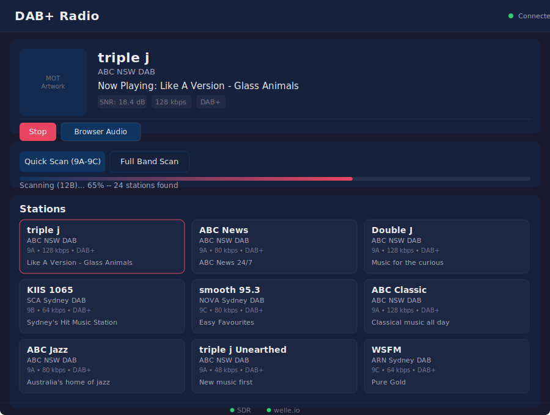

# DAB+ Radio

A web-based DAB+ (Digital Audio Broadcasting) radio application for Australian Band III, powered by [RTL-SDR](https://www.rtl-sdr.com/) hardware and [welle.io](https://github.com/AlbrechtL/welle.io).

Scan for stations, stream live radio in your browser, and view real-time metadata — all from a clean, dark-themed web interface.



## Features

- **Station scanning** — Quick scan (popular channels) or full Band III sweep across all 38 Australian channels
- **Adaptive dwell time** — Polls each channel for 4–12 seconds, exiting early when services stabilise
- **Automatic retry** — Channels that return no services on the first pass are retried automatically
- **SDR gain control** — Configurable AGC, manual gain, and PPM frequency correction
- **Browser & server playback** — Listen through your browser, server speakers (via mpg123), or both simultaneously
- **Live metadata** — Real-time DLS (now-playing text), SNR, bitrate, and audio mode
- **MOT slideshow** — Station logos and artwork delivered over DAB+
- **Signal monitoring** — SNR and demodulator status at a glance
- **Scan diagnostics** — Per-channel scan report with status, retry count, and signal quality
- **Duplicate handling** — Same service on multiple channels is detected and alternate paths recorded
- **Data service filtering** — Data-only services (TPEG, slideshows) excluded by default
- **Responsive design** — Works on desktop and mobile
- **Zero frontend dependencies** — Vanilla HTML, CSS, and JavaScript with no build step

## Requirements

- **Hardware:** RTL-SDR USB dongle (RTL2832U-based)
- **OS:** Ubuntu 24.04 (other Debian-based distros may work)
- **Python:** 3.10+

## Quick Start

```bash
# Clone the repository
git clone https://github.com/tunlezah/dab.git
cd dab

# Run the installer (builds welle-cli, installs dependencies, sets up systemd service)
sudo ./install.sh

# Open the web UI
xdg-open http://localhost:8080
```

The installer handles everything: system packages, building welle-cli from source, RTL-SDR driver configuration, Python virtualenv setup, and systemd service registration.

## Manual Setup

If you prefer to set things up yourself:

```bash
# Install system dependencies
sudo apt install rtl-sdr librtlsdr-dev libfaad-dev libmpg123-dev libfftw3-dev \
    libusb-1.0-0-dev libmp3lame-dev python3 python3-venv mpg123

# Build welle-cli from source
git clone https://github.com/AlbrechtL/welle.io.git
cd welle.io && mkdir build && cd build
cmake .. -DBUILD_WELLE_CLI=ON -DRTLSDR=ON
make -j$(nproc)
sudo make install
cd ../..

# Set up Python environment
python3 -m venv venv
source venv/bin/activate
pip install -r requirements.txt

# Run the server
uvicorn server.main:app --host 0.0.0.0 --port 8080
```

## Usage

### Scanning for Stations

1. Open the web UI at `http://<host>:8080`
2. Click **Quick Scan (9A-9C)** for Sydney metro defaults, or **Full Band Scan** for all channels
3. Watch the progress bar as stations are discovered

### Playing a Station

Click any station card to start playback. Use the output mode dropdown to switch between:

| Mode | Description |
|------|-------------|
| **Browser Audio** | Stream plays through your browser's audio element |
| **Server Audio** | Audio plays on the server's speakers via mpg123 |
| **Both** | Simultaneous browser and server playback |

### Service Management

```bash
sudo systemctl start dab-radio     # Start the service
sudo systemctl stop dab-radio      # Stop the service
sudo systemctl status dab-radio    # Check status
sudo journalctl -u dab-radio -f    # View logs
```

## Configuration

All settings are configured via environment variables. Set them in `/opt/dab-radio/.env` or the systemd service file.

| Variable | Default | Description |
|----------|---------|-------------|
| `WEB_PORT` | `8080` | Web UI port |
| `WELLE_CLI_PORT` | `7979` | Internal welle-cli HTTP port |
| `WELLE_CLI_PATH` | `welle-cli` | Path to welle-cli binary |
| `SCAN_DWELL_TIME` | `4.0` | Legacy: used as default for `SCAN_MIN_DWELL` |
| `SCAN_MIN_DWELL` | `4.0` | Minimum seconds per channel before early exit |
| `SCAN_MAX_DWELL` | `12.0` | Maximum seconds per channel before giving up |
| `SCAN_POLL_INTERVAL` | `1.0` | Seconds between mux.json polls during dwell |
| `SDR_GAIN` | _(unset)_ | Manual gain in tenths of dB (overrides AGC) |
| `SDR_AGC` | `true` | Enable automatic gain control (`-Q` flag) |
| `SDR_PPM` | `0` | PPM frequency correction for RTL-SDR drift |
| `INCLUDE_DATA_SERVICES` | `false` | Include data-only services in station list |
| `METADATA_POLL_INTERVAL` | `2.0` | Seconds between metadata updates |
| `WELLE_CLI_STARTUP_DELAY` | `2.0` | Seconds to wait for welle-cli startup |
| `POPULAR_CHANNELS` | `9A,9B,9C` | Comma-separated channels for quick scan |

## API

The backend exposes a REST API for programmatic access.

| Method | Endpoint | Description |
|--------|----------|-------------|
| `GET` | `/api/status` | System health and current state |
| `POST` | `/api/scan?mode=full\|popular` | Start a channel scan |
| `GET` | `/api/scan/progress` | Scan progress (channel, percent, stations found) |
| `GET` | `/api/scan/report` | Per-channel scan status from last scan |
| `GET` | `/api/sdr/config` | Current SDR gain/AGC/PPM settings |
| `POST` | `/api/sdr/config` | Update SDR settings (restarts welle-cli) |
| `GET` | `/api/stations` | List all discovered stations |
| `POST` | `/api/play/{service_id}` | Tune to a station (`{"output": "browser"}`) |
| `DELETE` | `/api/play` | Stop playback |
| `GET` | `/api/stream/{service_id}` | MP3 audio stream (for browser playback) |
| `GET` | `/api/slide/{service_id}` | MOT slideshow image |
| `GET` | `/api/metadata` | Current station metadata and signal info |

## Architecture

```
Browser  ──HTTP──▶  FastAPI (Python)  ──HTTP──▶  welle-cli  ──USB──▶  RTL-SDR
  │                      │                           │
  ├── UI polling         ├── Process management      ├── DAB+ demodulation
  ├── Audio stream       ├── Station registry        └── MP3 encoding
  └── Metadata display   └── Audio routing (mpg123)
```

See [ARCHITECTURE.md](ARCHITECTURE.md) for the full design document.

## Project Structure

```
├── server/
│   ├── main.py              # FastAPI application entry point
│   ├── routes.py             # API endpoint definitions
│   ├── config.py             # Environment-based configuration
│   ├── welle_manager.py      # welle-cli process lifecycle
│   ├── scanner.py            # Band III channel scanning
│   ├── station_registry.py   # In-memory station store
│   └── audio_manager.py      # Server-side audio (mpg123)
├── web/
│   ├── index.html            # Single-page application
│   ├── app.js                # Frontend logic
│   └── style.css             # Dark theme styles
├── tests/
│   ├── conftest.py           # Shared fixtures
│   ├── test_routes.py        # API endpoint tests
│   ├── test_scanner.py       # Scanner unit tests
│   └── test_station_registry.py
├── install.sh                # Automated installer
├── dab-radio.service         # systemd unit file
└── requirements.txt          # Python dependencies
```

## Testing

```bash
# Activate the virtualenv
source venv/bin/activate

# Run all tests
pytest tests/

# Run with verbose output
pytest tests/ -v
```

## Tech Stack

- **Backend:** [FastAPI](https://fastapi.tiangolo.com/) + [uvicorn](https://www.uvicorn.org/)
- **Frontend:** Vanilla HTML/CSS/JS (no build step)
- **DAB+ Engine:** [welle-cli](https://github.com/AlbrechtL/welle.io) (welle.io CLI mode)
- **SDR Hardware:** RTL-SDR (RTL2832U)
- **Audio:** mpg123 for server-side playback
